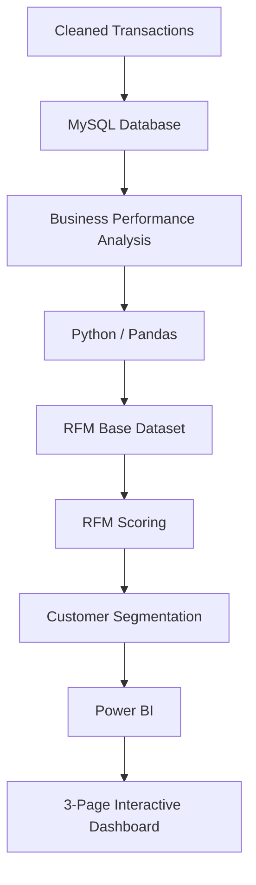

# E-Commerce RFM Analytics

### Executive Summary

An end-to-end e-commerce customer analytics project built using **MySQL**, **Python**, and **Power BI**. The project analyzes transaction-level retail data in SQL, uses Python to calculate Recency, Frequency, and Monetary (RFM) metrics for **5,863 customers**, categorizes them into **8 actionable business segments**, and visualizes revenue concentration and retention risks across a **3-page interactive Power BI dashboard**

### Business Objective

The project answers four practical questions:
1. How is overall e-commerce performance changing over time?
2. Which customers contribute the most revenue and which groups need attention?
3. Which products and markets drive sales?
4. How can transaction-level data be converted into actionable customer segments?

### Tools

- MySQL
- Python / Pandas
- Power BI / DAX
- Excel
- GitHub

### Dataset

**Source :** UCI Online Retail II.

The dataset contains historical transactions from a UK-based online retailer covering December 2009 to December 2011. Monetary values in this project are treated as GBP (£).

The cleaned transactional file used for the RFM stage contained 778,735 rows and produced an RFM dataset of 5,863 customers.

| Metric | Project Value |
| :--- | :--- |
| RFM input rows | 778,735 |
| RFM customers | 5,863 |
| Analysis period | Dec 2009 – Dec 2011 |
| Total revenue | £17.22M |
| Total orders | 36.78K |
| Units sold | 10.50M |
| Products | 4,629 |
| Average order value | £468.24 |

RFM analysis date: 2011-12-10 12:50:00.

### Workflow

### SQL Analysis

The completed SQL work was organized into 12 business-focused sections:

1. Database setup
2. Transaction table
3. Data import
4. Data validation
5. Overall business performance
6. Order performance
7. Country performance
8. Customer performance
9. Customer purchase frequency
10. Product performance
11. Monthly sales performance
12. Customer revenue concentration

Key techniques included aggregations, CTEs, CASE, LAG(), RANK(), window functions and revenue-share calculations.

### RFM Analysis

The RFM input contained:

- Invoice
- InvoiceDate
- Customer ID
- Total Amount

#### Metrics

**Recency :** days since the customer's latest purchase.
**Frequency :** number of distinct orders.
**Monetary :** total revenue generated by the customer.

The final RFM table contained 5,863 customers.

Validation confirmed:

- 5,863 unique customers
- 0 missing RFM values
- 0 duplicate customers

Each RFM component was scored from 1 to 5, giving an RFM Total range of 3–15.

### Customer Segmentation

The final eight business-oriented segments were:

| Segment | Customers | Revenue | Revenue Share |
| :--- | :--- | :--- | :--- |
| VIP | 1,282 | £11.73M | 68.11% |
| Steady Regular | 654 | £1.83M | 10.65% |
| Customer at Risk | 622 | £1.52M | 8.83% |
| Occasional Customer | 901 | £0.89M | 5.17% |
| Growing Customer | 594 | £0.78M | 4.53% |
| Inactive Customer | 1,279 | £0.32M | 1.88% |
| Promising Customer | 418 | £0.11M | 0.64% |
| Recent Onboarding | 113 | £0.03M | 0.20% |

The labels were deliberately kept natural and business-oriented.

### Power BI Dashboard

#### Page 1 — Executive Overview

Focuses on high-level business performance, revenue trends, and key executive KPIs.

#### Page 2 — Customer & RFM Analytics

Focuses on customer valuation, engagement, RFM distribution, and segment breakdown.

#### Page 3 — Product & Sales Performance

Focuses on product revenue contribution, volume trends, and geographic market drivers.

All three pages use interactive Date Range and Country slicers.

### Key Findings

#### 1. VIP revenue concentration
The 1,282 VIP customers generate £11.73M, representing 68.11% of total customer revenue.

#### 2. UK market concentration
The United Kingdom contributes approximately 83.12% of revenue.

#### 3. At-risk customer value
The 622 customers classified as Customer at Risk contribute £1.52M.

#### 4. Seasonal sales pattern
Revenue and sales volume rise noticeably during September–November across the observed years.

#### 5. Uneven customer value
The customer base contains a large inactive/low-engagement group alongside a smaller group of highly valuable customers.

### Future Enhancements
Potential next steps and analytical extensions for this project:

- **Cohort & Retention Analysis:** Track customer retention curves and month-over-month cohort churn rates.
- **Customer Lifetime Value (CLV):** Predict long-term customer monetary value using historical purchase velocity.
- **Product Affinity & Basket Analysis:** Identify frequently co-purchased product categories (Market Basket Analysis).
- **Churn Prediction Model:** Build a machine learning classification model to identify high-risk customers before they churn.
- **Automated Data Pipeline:** Set up scheduled database refreshes and automated Power BI dataset updates.

*Note : These items represent potential future extensions and are not included in the current project scope.*

### Project Status
**Status :** Completed [x]

* **Delivered Components :** Data auditing, SQL database schema & performance queries, Python RFM calculation & 8-segment customer clustering, 3-page interactive Power BI dashboard, and complete portfolio documentation.
